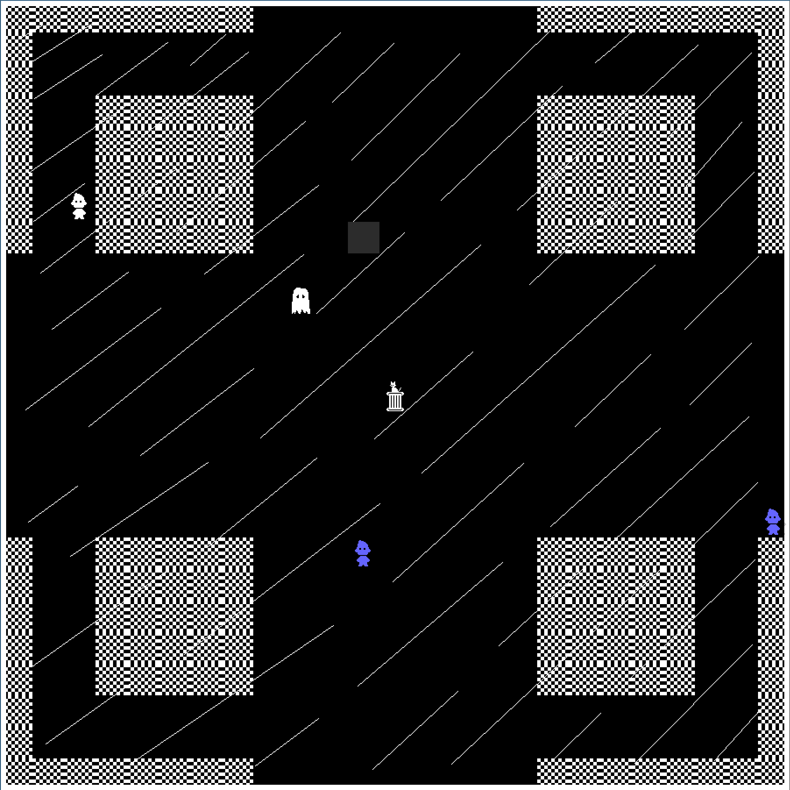

# The Reckoning

 

This software uses the [Creative Commons Attribution-NonCommercial-ShareAlike 4.0 International Public License](LICENSE.md) don't @ me.

## Building
- Windows
  - Clone the repository (from windows branch) and unzip it
  - You must have a MinGW32 installation of G++
  - Run mingw32-make from within the directory
- Linux
  - Clone the repository (from main branch)
  - SDL2 and SDL2_ttf are required dependencies
  - run `make`
